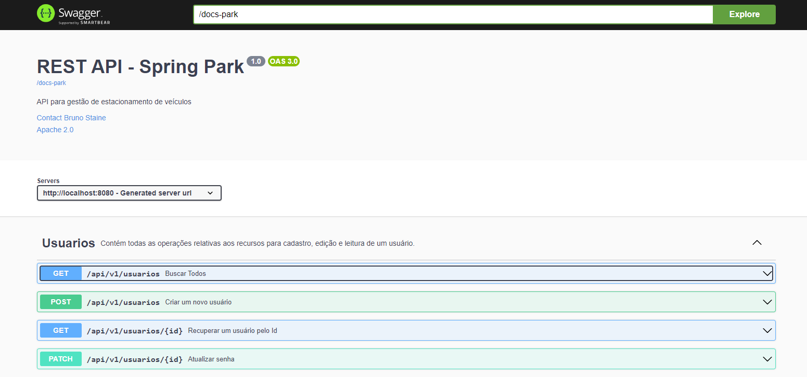

# API Rest para controle de estacionamento de veículos

## :clipboard: Descrição

Esse é o projeto de uma API Rest para controle de estacionamento de veículos. A ideia é ter o controle das vagas e fazer as validações necessárias para que o sistema funcione corretamente.

## :wrench: Funcionalidades
- Armazenar dois tipos de usuários Admin e Cliente
- Armazenar os dados dos clientes
- Armazenar os dados das vagas
- Armazenar os dados do estacionamento
- Autenticação
- Permissões para tipos de usuários

## :open_file_folder: Tecnologias utilizadas

## :rocket: Inicialização
Esse projeto foi desenvolvido em ambiente Windows, utilizando as tecnologias citadas anteriormente.
Caso você utilize outro sistema operacional, a configuração inicial do projeto pode ser um pouco diferente.

Utilize o Java 17
Utilize o Spring boot versão 3.1.6
Crie um container mysql na docker
Utilize o dBeaver ou Workbranch para monitorar o banco de dados
Utilize o dBeaver ou PGAdmin para monitorar o banco de dados
Utilize a IDE de sua preferência a que usei foi a InteliJ
Utilize ferramentas como postman ou insominia para testar os endponts

## :large_blue_circle: Implementações futuras
1. Implementar Tickets
2. Implementar Relatórios PDFs
3. Implementar Swagger
4. Implementar Testes
5. Implementar Autenticação 
6. Implementar Permissões de acesso
7. Implementar Clientes e seus recursos
8. Implementar Vagas e seus recursos
9. Implementar Estacionamento e seus recursos

## :globe_with_meridians: Status do projeto

## :mag_right: Referências
Em breve ...

## :open_file_folder: Imagens
Em breve ...

## :construction_worker: Autor
 
Bruno Staine Caires de Oliveira 
